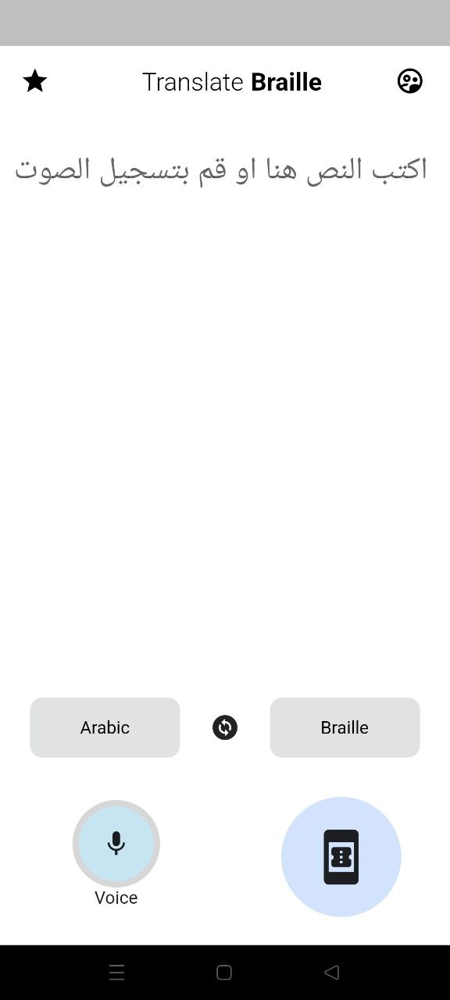
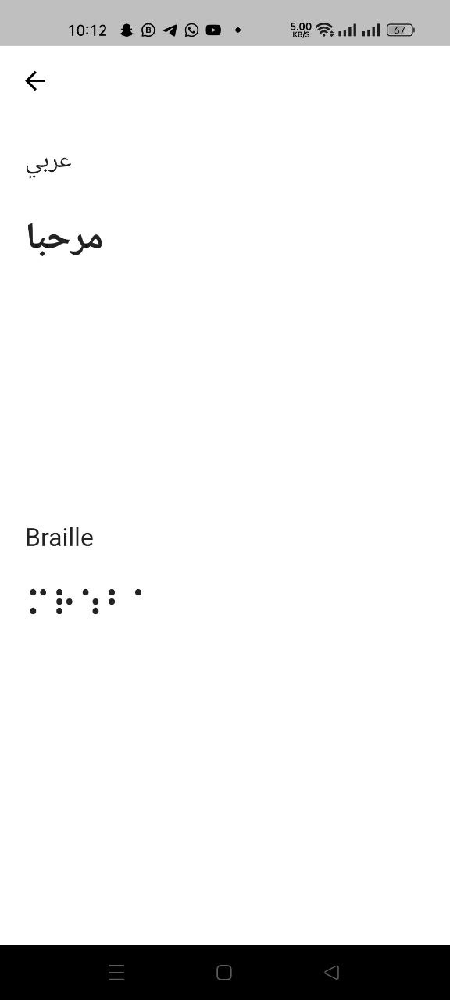
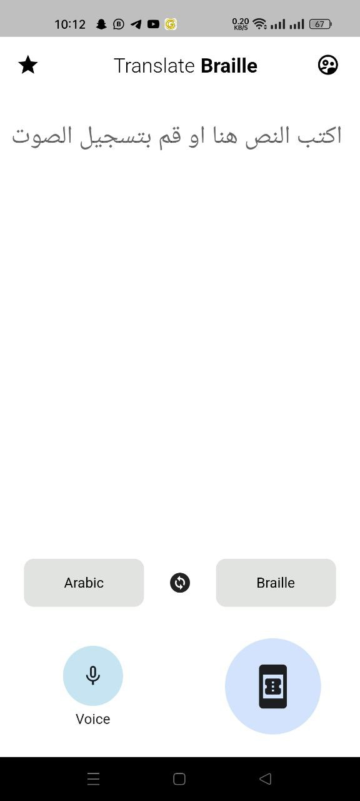

# BrailleVoiceApp

BrailleVoiceApp is a simple application designed to assist individuals with visual impairments. The app converts spoken language into Braille text, which can be read using specialized devices. It serves as a valuable tool for communication and education, enabling users to both understand Braille and learn it.

## Table of Contents
- [Introduction](#introduction)
- [Features](#features)
- [Usage](#usage)
- [Specialized Devices](#specialized-devices)
- [Educational Tool](#educational-tool)
- [Installation](#installation)
- [Contributing](#contributing)
- [Contact](#contact)
- [Some Screenshots](#screenshots)
- [License](#license)

## Introduction
BrailleVoiceApp is designed to cater to the needs of visually impaired individuals. It offers a unique approach to communication by converting spoken language into Braille text. The app provides an easy way for users to communicate with others and gain access to information.

## Features
- Real-time conversion of spoken language to Braille text.
- Utilizes specialized devices to facilitate Braille reading.
- Enhances communication and information access for visually impaired individuals.
- Can be used as a learning tool for those interested in Braille.
- Offers a user-friendly interface for easy interaction.
- Supports both spoken language input and voice recording for conversion.

## Usage
To use BrailleVoiceApp, follow these steps:
1. Speak the desired message in the language you are comfortable with.
2. The app will instantly convert the spoken message into Braille text.
3. Connect to a specialized Braille reading device for tactile reading.

## Specialized Devices
BrailleVoiceApp can be used in conjunction with specialized Braille reading devices that provide tactile feedback. These devices enable visually impaired users to read the converted Braille text with their fingers.

## Educational Tool
BrailleVoiceApp serves as an educational tool as well. It aids instructors in teaching Braille to interested learners by:
- Allowing them to write or record speech.
- Instantly converting the text or speech into Braille.

## Installation
1. Clone the repository to your local machine.
2. Install any required dependencies.
3. Build and run the app using your preferred development environment.

## Contributing
Contributions are welcome! If you'd like to contribute to BrailleVoiceApp, please follow these steps:
1. Fork the repository.
2. Create a new branch for your feature or improvement.
3. Make your changes and test thoroughly.
4. Submit a pull request detailing your changes.

## Contact
For inquiries or suggestions, you can reach out to me through my [Facebook](https://www.facebook.com/mostafa.atta.9085) or [LinkedIn](https://www.linkedin.com/in/mostafa-3tta-5949581a2/) profiles.

## screenshots
 

 

 

 

## License
This project is licensed under the [MIT License](LICENSE).
